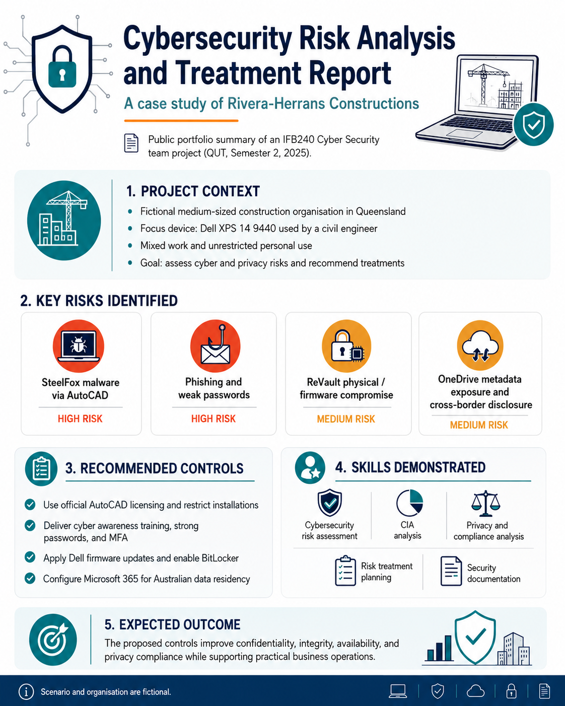

# Cybersecurity Risk Analysis and Treatment Report

A public portfolio version of an academic cybersecurity risk analysis project completed for IFB240 Cyber Security at Queensland University of Technology during Semester 2, 2025.

## Project Snapshot



This project analyses cyber and privacy risks affecting a fictional medium-sized construction organisation, Rivera-Herrans Constructions, focusing on a Dell XPS 14 9440 device used by a civil engineer for both work and unrestricted personal use.

## Project Overview

The report applies cybersecurity risk analysis concepts to identify, evaluate, and recommend treatment strategies for risks affecting sensitive construction project data, business operations, and cloud-based file storage.

The analysis considers confidentiality, integrity, and availability impacts across key work applications such as AutoCAD, Procore, Outlook, OneDrive, Teams, Word, and Excel.

## Key Risks Analysed

- SteelFox malware risk through unofficial AutoCAD installers
- Phishing and weak password risk caused by user behaviour
- ReVault physical / firmware compromise affecting Dell devices
- OneDrive metadata exposure and cross-border disclosure risk

## Recommended Controls

- Use official AutoCAD licensing and restrict software installation
- Deliver cyber awareness training and enforce strong password practices
- Enable multi-factor authentication
- Apply Dell firmware updates and enable BitLocker
- Configure Microsoft 365 for Australian data residency
- Develop cloud governance and device-loss procedures

## Visual Summary

The repository includes visual summaries to make the project easier to review:

- [Project overview infographic](visuals/project-overview.png)
- [Cybersecurity risk matrix](visuals/risk-matrix.png)
- [Risk treatment roadmap](visuals/treatment-roadmap.png)
- [CIA summary of key information assets](visuals/cia-summary.png)
- [OneDrive privacy risk summary](visuals/onedrive-privacy-risk-summary.png)

## Skills Demonstrated

- Cybersecurity risk assessment
- CIA analysis
- Risk evaluation and prioritisation
- Privacy and compliance analysis
- Security control recommendation
- Technical documentation
- Professional report preparation

## Repository Contents

```text
.
├── README.md
├── report/
│   └── IFB240_Cybersecurity_Risk_Analysis_Public_Portfolio_Version.pdf
└── visuals/
    ├── project-overview.png
    ├── risk-matrix.png
    ├── treatment-roadmap.png
    ├── cia-summary.png
    └── onedrive-privacy-risk-summary.png

```

## Disclaimer

This repository contains a public portfolio version of an academic team project. The organisation and scenario are fictional and were created for academic purposes. Private student information, student numbers, team member identifying details, and unnecessary appendix material have been removed.